<div align="center" markdown="1">


# Nexus Theme

**Make your workspace yours.** Colours, sounds, a themed sign-in screen and a clear view of who can do what, all inside your ERPNext / Frappe Desk. Pick one of 17 ready-made themes or build your own, choose the sounds the Desk plays, give the login page your own look, and let administrators see and change permissions in plain language.

   

**Two branches, one app.** You are looking at the build for Frappe / ERPNext **16**
— branch [`main`](https://github.com/abbas0444/nexus_theme/tree/main), also published
as [`version-16`](https://github.com/abbas0444/nexus_theme/tree/version-16).
Running Frappe / ERPNext **15**? Use
[`version-15`](https://github.com/abbas0444/nexus_theme/tree/version-15).

</div>

---

## A Look at It

Every screenshot below is the app running on a real ERPNext 16 site.

| Theme Studio | Permission Inspector |
|---|---|
| 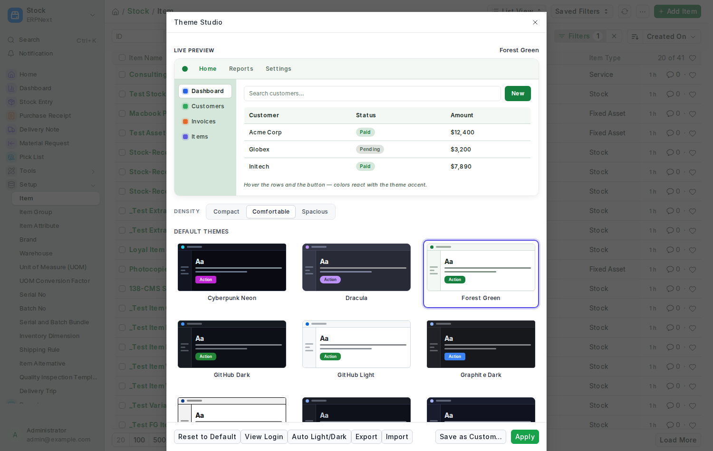 | 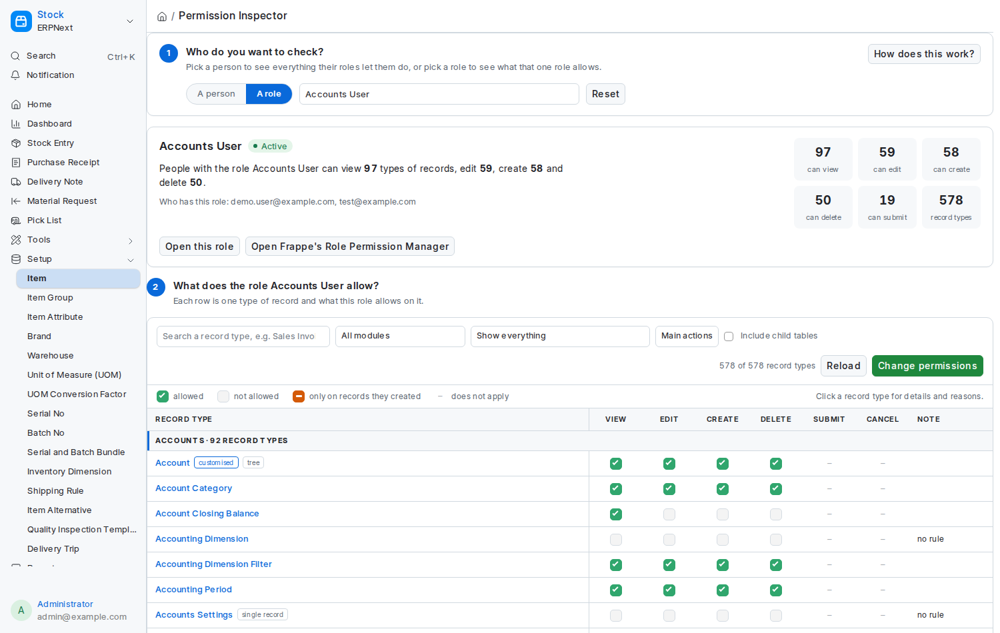 |
| Pick a theme and watch a miniature Desk repaint as you go. | See what a role or a person may do, record type by record type. |

| Sign-in screen | Sound Studio |
|---|---|
| 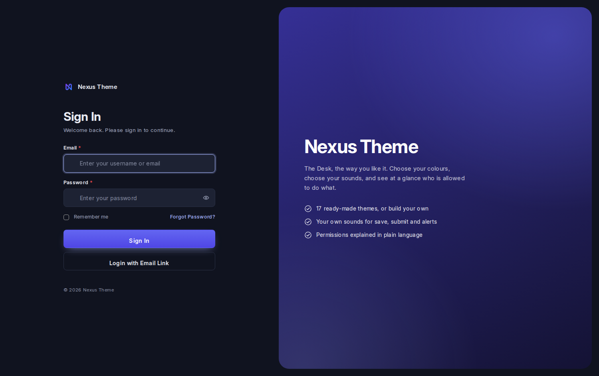 | 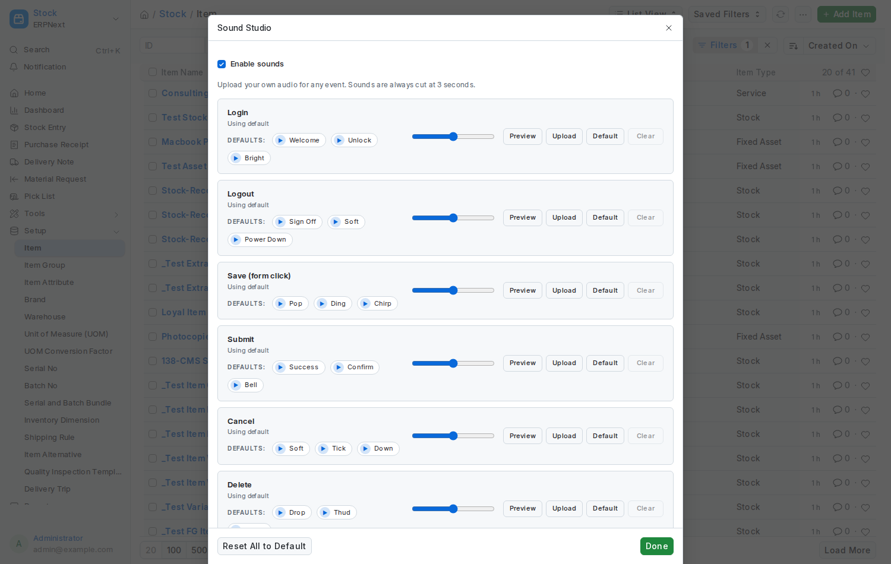 |
| Optional two-column login page, painted in your theme. | Choose the sound the Desk plays for each event. |

---

## Table of Contents

1. [What Nexus Theme Gives You](#1-what-nexus-theme-gives-you)
2. [Install It](#2-install-it)
3. [Where to Find Everything on the Desk](#3-where-to-find-everything-on-the-desk)
4. [Theme Studio: Pick and Build Themes](#4-theme-studio-pick-and-build-themes)
5. [Sound Studio: Choose Your Sounds](#5-sound-studio-choose-your-sounds)
6. [Permission Inspector: Who Can Do What](#6-permission-inspector-who-can-do-what)
7. [Administrator Guide: Theme Settings](#7-administrator-guide-theme-settings)
8. [The Record Types Behind It All](#8-the-record-types-behind-it-all)
9. [Who Can Use What (Roles)](#9-who-can-use-what-roles)
10. [Everyday Recipes](#10-everyday-recipes)
11. [How It Works Under the Hood](#11-how-it-works-under-the-hood)
12. [For Developers](#12-for-developers)
13. [Things to Know](#13-things-to-know)
14. [Troubleshooting and FAQ](#14-troubleshooting-and-faq)
15. [Requirements and License](#15-requirements-and-license)

---

## 1. What Nexus Theme Gives You

Nexus Theme is one Frappe app with three tools inside it. Install it once and every feature is ready; nothing needs to be switched on.

| Tool | Who it is for | What it does |
|---|---|---|
| **Theme Studio** | Everyone who uses the Desk | Pick a theme, adjust colours and fonts with a live preview, generate a whole theme from one brand colour, pair a light and a dark theme, share themes with the team, export and import themes as files. |
| **Sound Studio** | Everyone who uses the Desk | Choose the sound the Desk plays on login, save, submit, cancel, delete, errors, email, alerts and notifications. Use a bundled preset or upload your own, set the volume, or mute everything. |
| **Permission Inspector** | System Managers | Pick a person or a role and see, record type by record type, what they may View, Edit, Create, Delete, Submit and Cancel, which role gives them that, and change it safely from the same screen. |
| **Theme Settings** | System Managers | Site-wide controls: a default theme for everyone, an allowed list, whether people may build or share themes, the company logo and favicon, and a master switch for sounds. |
| **Login Page** | System Managers switch it on; everyone sees it | A two-column sign-in screen painted in the site's theme colours, with your logo, your headline and bullet points on a coloured panel. Off by default; Frappe's own login page stays until you turn it on. |
| **Three record types** | Nobody has to open them | *Theme Definition*, *User Theme Preference* and *User Sound Preference* are where the studios store everything. They are listed in the workspace so you can look, fix or pre-build a company theme — see [section 8](#8-the-record-types-behind-it-all). |

Everything is per user. Your theme and sounds are yours; nobody else sees them unless you share a theme on purpose.

---

## 2. Install It

**On Frappe Cloud:** open your site, choose *Apps → Install App*, and pick **Nexus Theme** from the Marketplace. Nothing else to do.

### Which version do I need?

Run `bench version` first and read the **frappe** line.

| Your bench | Branch to install | Install with |
|---|---|---|
| Frappe / ERPNext **16** | `version-16` (same code as `main`) | `bench get-app --branch version-16 https://github.com/abbas0444/nexus_theme.git` |
| Frappe / ERPNext **15** | `version-15` | `bench get-app --branch version-15 https://github.com/abbas0444/nexus_theme.git` |

Both branches hold the same features; they differ only where the two frameworks
differ. `main` is the same code as `version-16`, so leaving `--branch` out gets you
the 16 build. Installing the wrong one damages nothing, but the app will not work
properly — switch branches and run `bench --site yoursite.com migrate` again.

**On your own bench:** run these commands. Replace `yoursite.com` with your site name.

```bash
cd /path/to/your/bench
bench get-app --branch version-16 https://github.com/abbas0444/nexus_theme.git
bench --site yoursite.com install-app nexus_theme
bench --site yoursite.com migrate
bench restart          # or restart `bench start` in development
```

Installation does all of this for you:

- Creates the **Theme User** role and gives it to every Desk user, so Theme Studio and Sound Studio work at once. New Desk users get the role automatically when they are created or promoted.
- Loads the **17 bundled themes**.
- Creates the **Theme Settings** record with every option switched off, so the app changes nothing about your site until you decide.
- Adds **Theme Studio** and **Sound Settings** to the avatar menu, the **Nexus Theme** tile to the apps screen, and the **Nexus Theme** workspace with all its shortcuts.
- Registers the **Permission Inspector** page for System Managers.

Updating later is the usual `bench update` or `git pull` followed by `bench --site yoursite.com migrate`. Your custom themes and sound choices survive updates.

Uninstalling (`bench --site yoursite.com uninstall-app nexus_theme`) removes the role, the menu items, the tile and the app's own tables. It never touches Frappe's own permission records.

---

## 3. Where to Find Everything on the Desk

| Place | What you will see |
|---|---|
| **Avatar menu** (top-right) | Theme Studio, Sound Settings |
| **Apps screen** (the grid icon or `/apps`) | A **Nexus Theme** tile that opens the workspace |
| **Nexus Theme workspace** (`/app/nexus-theme`) | Shortcuts to Theme Studio, Sound Studio, Themes, Theme Settings and Permission Inspector, plus cards for every record type the app owns |
| **Search bar** (Ctrl+K / Cmd+K) | Type `Theme Studio`, `Sound Studio`, `Permission Inspector` or `Theme Settings` |
| **Frappe's own Switch Theme dialog** (avatar menu, Toggle Theme) | Every Nexus theme is listed there too, next to Frappe Light and Timeless Night |
| Direct links | `/app/theme-studio`, `/app/sound-studio`, `/app/nexus-permission-inspector`, `/app/theme-settings` |
| **Login page** (`/login`) | Frappe's own sign-in screen, or the Nexus login page once an administrator switches it on in Theme Settings |

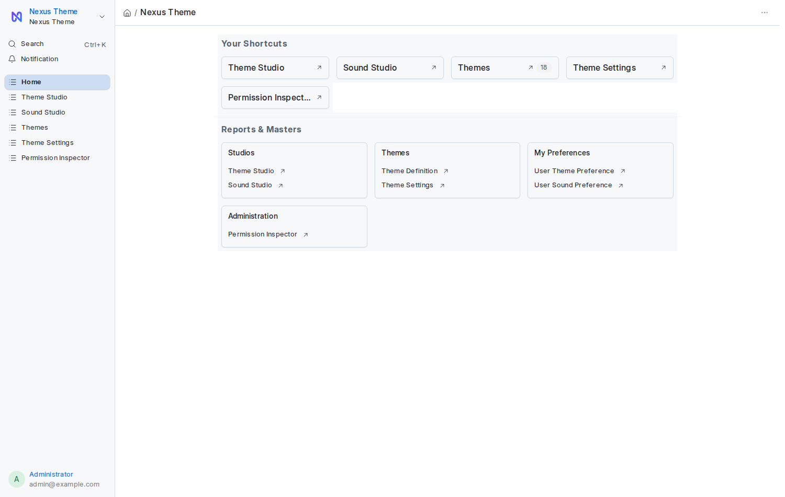

*The workspace at `/app/nexus-theme`: shortcuts on top, record types underneath. The three pages sit in the sidebar on the left.*

The apps screen carries a **Nexus Theme** tile, and the avatar menu in the corner opens either studio from wherever you are:

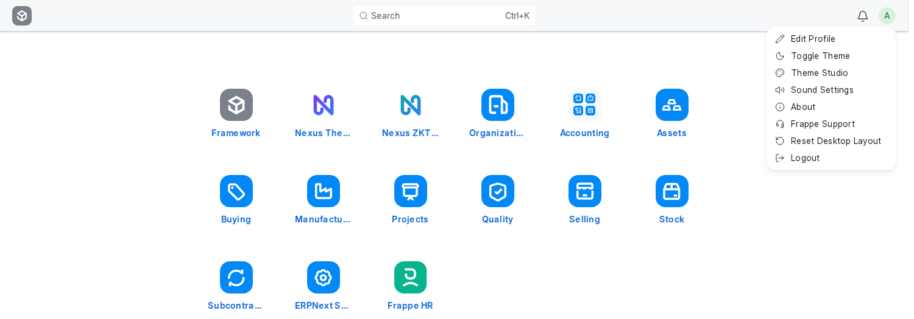

---

## 4. Theme Studio: Pick and Build Themes

### 4.1 The five-minute flow

1. Click your **avatar** (top-right) and choose **Theme Studio**.
2. Click any theme card. The **Live Preview** inside the dialog, a small mock-up of the Desk, shows how it looks.
3. Happy? Click **Apply** and the whole Desk changes at once. Not sure? Click another card. Nothing is stored until you press Apply.
4. Want to tweak it? Click **Customize** and adjust colours; the preview follows every change.
   Press **View Login** at any point to see the sign-in screen in the same theme.
5. Want to keep your tweaks? Click **Save as Custom…**, give it a name and, if you like, tick **Share with other users**.

Your choice is remembered on every device you log in from.


*Theme Studio. The Live Preview at the top is a miniature Desk — navbar, sidebar, table, buttons — so you can judge a theme before applying it. The buttons along the bottom are always in reach.*

Click a different card and only the preview changes. The Desk behind it stays as it was until you press **Apply**:

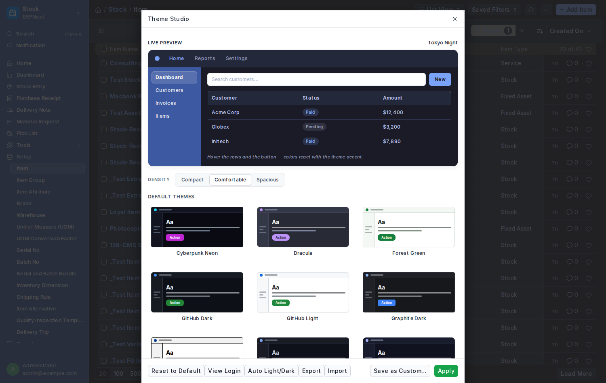

**View Login** opens the sign-in screen in whichever theme is selected, without signing out:

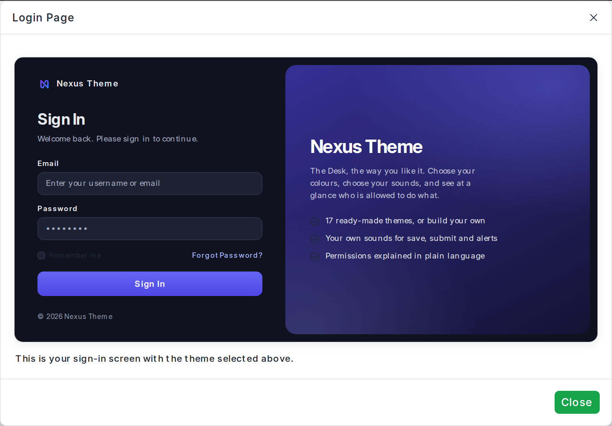

### 4.2 The three theme lists

| List | What is in it |
|---|---|
| **Default Themes** | The 17 themes that ship with the app |
| **My Custom Themes** | Themes you saved. Only you see them, and you can delete them here. |
| **Public Themes** | Themes your colleagues chose to share with everyone |

The 17 bundled themes are:

- **Dark:** Midnight Indigo, Graphite Dark, Nord Frost, Dracula, Tokyo Night, GitHub Dark, Material Ocean, Cyberpunk Neon
- **Light:** GitHub Light, Solarized Light, Ocean Breeze, Forest Green, Rose Quartz, Mint Fresh, Solar Warmth, Sepia Reader, High Contrast

### 4.3 The editor: Basic and Advanced

Click **Customize** on any theme. The editor shows a **Live Preview** card and a set of controls. Every change is applied to the Desk behind the dialog as you make it.

**Basic** shows the controls most people need:

| Control | What it changes |
|---|---|
| Background | The main backdrop of the Desk |
| Text Color | Text on that backdrop |
| Accent | Links, highlights, the active item |
| Font Family | Inter, system fonts, monospace and more |
| Font Size | The base size everything scales from |
| Corner Radius | How rounded cards, buttons and inputs are |
| Hover Lift | Cards rise slightly when you hover over them |

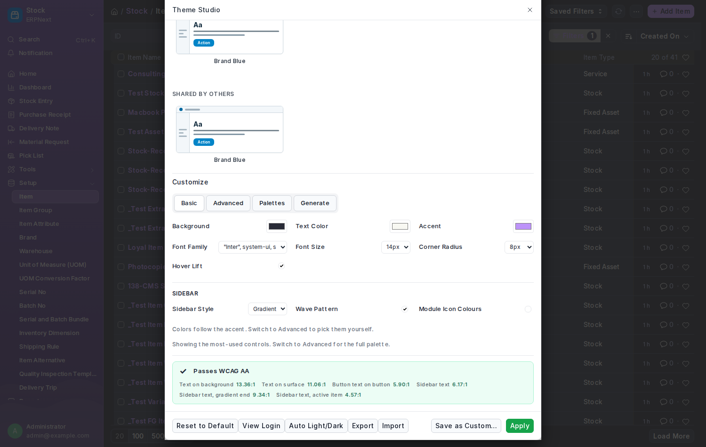

*The Basic tab. The green bar at the bottom is the readability check — it recalculates on every change, so you always know whether the theme is legible before you save it.*

**Advanced** adds the rest of the 11 colours and the finer settings:

| Control | What it changes |
|---|---|
| Surface / Cards | Cards, sidebars and panels |
| Input Background | Search boxes and form fields |
| Muted Text | Secondary labels and hints |
| Accent Hover | The accent colour when you hover |
| Button Color, Button Text, Button Hover | The primary buttons |
| Border | Lines between sections |
| Font Weight | Lighter or bolder text overall |
| Animation Speed | How fast hover and fade effects run |

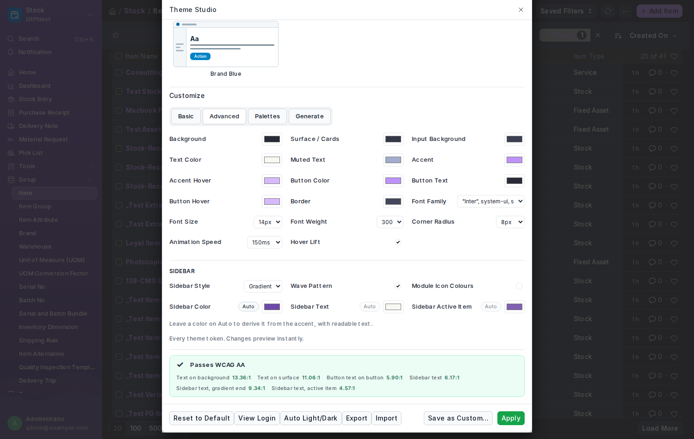

### 4.4 Palettes: fill all 11 colours at once

Open the **Palettes** tab and click a set. Every colour in the editor is filled together, and each set is checked for readability before it ships:

Indigo Mist · Forest Paper · Rose Quartz · Graphite Amber · Midnight Violet · Carbon Teal · Obsidian Rose · Nordic Frost

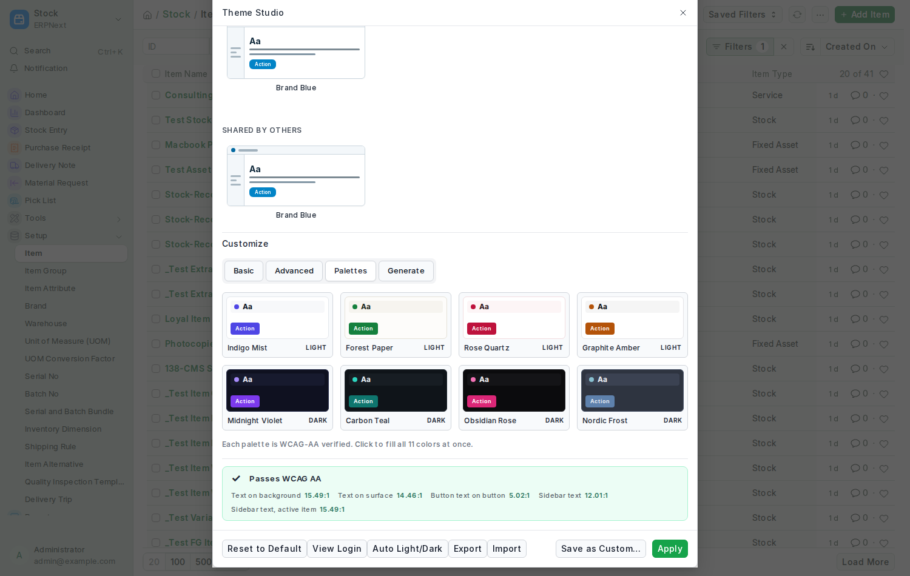

Use a palette as a starting point, adjust anything you like, then save.

### 4.5 Generate: a theme from one brand colour

Open the **Generate** tab, enter your brand colour, choose **Light** or **Dark**, and pick one of three readings of that colour:

| Variant | Best for |
|---|---|
| **Neutral Canvas** | A grey backdrop with your colour only on accents. Calm and focused. |
| **Tinted Canvas** | The backdrop carries a hint of your colour. Feels branded. |
| **High Contrast** | Stronger text and borders. Best for accessibility. |

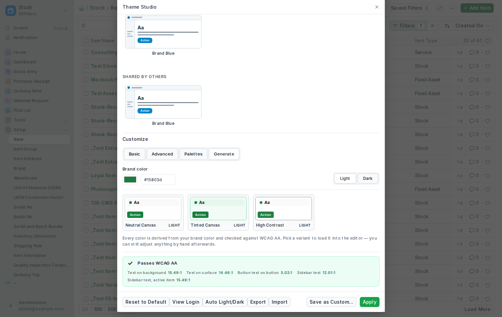

Each card shows its contrast numbers and a **Passes WCAG AA** badge. The generator solves for readability rather than fixed lightness steps, so it works whether your brand is yellow, navy or anything in between. Click a variant to fill the editor, then fine-tune and save.

### 4.6 Readability is checked before you save

Every theme you save is tested first:

- text on the background must reach a **4.5 : 1** contrast ratio
- text on cards must reach **4.5 : 1**
- button text on buttons must reach **3.0 : 1**

If a check fails you get a clear message naming the pair of colours to fix. You cannot save a theme nobody can read.

### 4.7 Automatic light and dark

Click **Auto Light/Dark** in Theme Studio, choose a light theme and a dark theme, set the mode to **Automatic** and save. The Desk now follows your operating system: switch your computer to dark mode and the dark theme appears by itself.

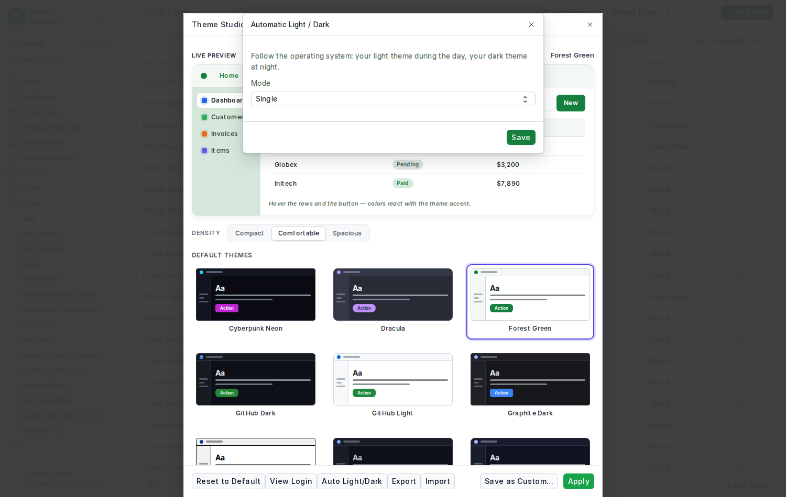

### 4.8 Share, export, import, delete

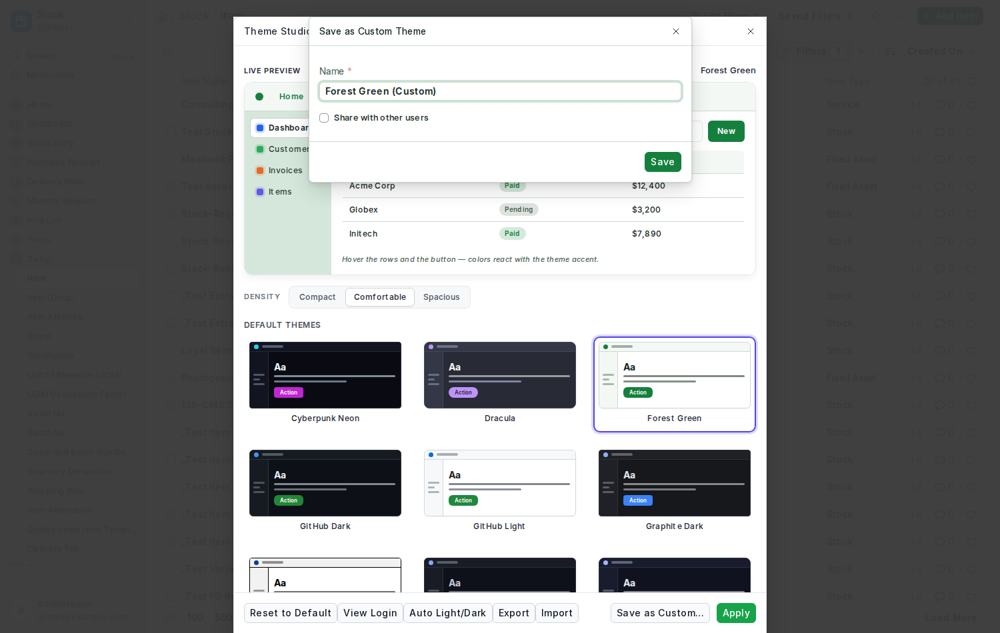

*Save as Custom… asks for a name and offers one tick box: share it, or keep it to yourself.*

- **Share:** tick **Share with other users** when saving. The theme appears in everyone's Public Themes list. Untick it by saving again without the tick.
- **Export:** select a theme and click **Export** to download it as a `.json` file.
- **Import:** click **Import** and choose a `.json` file from another site. The file is validated before anything is saved, so a bad or edited file cannot harm your site.
- **Delete:** open **My Custom Themes** and click **Delete** on the card. You can delete a theme even while you or a colleague are using it; whoever was using it drops back to the site default, or to Frappe's own look if there is none.

### 4.9 Going back to plain Frappe

Click **Reset to Default** at the bottom of Theme Studio, or choose Frappe Light, Timeless Night or Automatic in Frappe's own Switch Theme dialog. Both record that you want Frappe's built-in look, so an administrator's site default will not come back on your next reload. Pick any Nexus theme again to opt back in.

---

## 5. Sound Studio: Choose Your Sounds

### 5.1 The flow

1. Click your **avatar** and choose **Sound Settings** (or open the **Sound Studio** shortcut in the workspace).
2. Each row is one event. Press **Preview** to hear its current sound.
3. Choose one of the three **preset chips**, or press **Upload** to use your own `.mp3` or `.wav`.
4. Drag the **volume** slider for that event.
5. Everything saves as you go. Close the dialog when you are done.

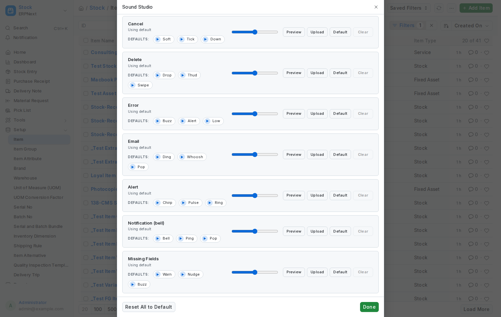

*One row per event. **Using default** means the row is untouched; upload a file and it says so instead.*

### 5.2 The events

| Event | Plays when | Presets |
|---|---|---|
| Login | You arrive on the Desk | Welcome, Unlock, Bright |
| Logout | You sign out | Sign Off, Soft, Power Down |
| Save | You save a form | Pop, Ding, Chirp |
| Submit | You submit a document | Success, Confirm, Bell |
| Cancel | You cancel a document | Soft, Tick, Down |
| Delete | You delete something | Drop, Thud, Swipe |
| Error | Something goes wrong | Buzz, Alert, Low |
| Email | An email is sent | Ding, Whoosh, Pop |
| Alert | A notification banner appears | Chirp, Pulse, Ring |
| Notification | A real-time message arrives (the bell) | Bell, Ping, Pop |
| Missing Fields | You save with a required field empty | Warn, Nudge, Buzz |

### 5.3 The buttons

On each row: **Preview** plays the current sound, **Upload** takes your own file, **Default** switches that event back to Frappe's own sound, and **Clear** removes your custom file. The three chips under **Defaults:** are the bundled presets; a **Custom uploaded** tag shows when your own file is in use.

At the bottom of the dialog:

- **Enable sounds** switch: mute every sound without losing your choices.
- **Reset All to Default**: asks for confirmation, then removes every custom sound so the defaults play again.
- **Done** closes the dialog. Every change was already saved as you made it.

Every sound is cut at three seconds, so a long file never becomes a nuisance. Uploaded files are ordinary Frappe files and are included in your normal backups.

All 36 bundled sounds are synthesised from scratch by `tools/generate_sounds.py`, so there are no licensing worries.

---

## 6. Permission Inspector: Who Can Do What

For **System Managers**. Open **Nexus Theme → Permission Inspector** or go to `/app/nexus-permission-inspector`.

> Frappe has a small built-in form that is also called *Permission Inspector* (under **Users → Permission Inspector**, at `/app/permission-inspector`). It checks one document for one person at a time. The Nexus Theme inspector is a different tool with its own address, so the two never get in each other's way.

### 6.1 The idea in three sentences

- **Roles decide what someone can do.** Every person has roles such as Accounts User or Sales User, and each role allows actions like View, Edit or Create on each type of record. A person can do something if any of their roles allows it.
- **User Permissions decide which records they can see.** They narrow a person down to, say, one Company or one Customer. They never add abilities.
- **Changing a permission changes a role.** So a change made here applies to everyone who has that role, not only the person you picked.

The **How does this work?** button on the page shows the same three points.

### 6.2 Step 1: pick a person or a role

Choose **A person** or **A role** and type a name. The page shows a summary in plain words, for example:

> *Abbas can view **120** types of records, edit **80**, create **62** and delete **12**.*

Under it you see the person's roles, warnings that matter (the account is disabled, a role is switched off, the Administrator cannot be limited), six counters, and three buttons: **Which records can they see?**, **Open this user**, and **Open Frappe's Role Permission Manager**. A long role list folds after the first twelve; press **N more** to see the rest.

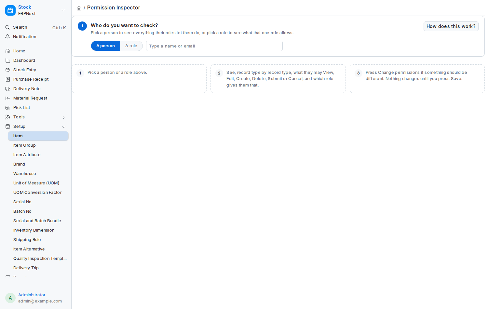

*Step 1. Choose **A person** or **A role**, then type a name. **How does this work?** explains roles and permissions in three short paragraphs.*

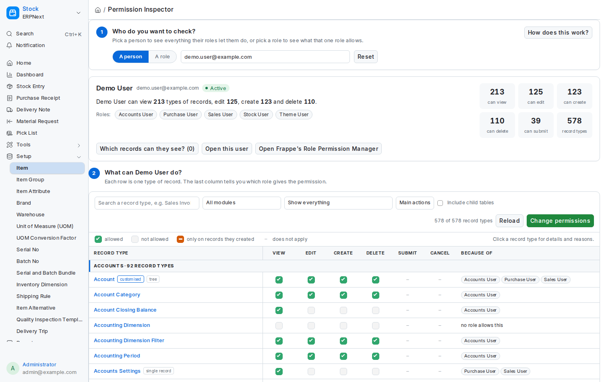

*Looking at a person: their roles as chips, one plain-English sentence, and six counters. The counters follow every edit you make below, before anything is saved.*

### 6.3 Step 2: read the table

Each row is one **record type** (Frappe calls it a DocType), grouped under its module. Each cell is a tick box, so a whole column reads at a glance:

| Box | Meaning |
|---|---|
| Ticked (green) | Allowed |
| Empty | Not allowed |
| Amber, with a bar instead of a tick | Allowed only on records they created themselves |
| – (no box) | Does not apply to this record type (for example Submit on a record type that never uses submission) |

A small amber dot on the corner of a ticked box means the role also has a separate *own records only* rule on top. Hover any box for the same thing in words. The legend above the table repeats all of this.

By default the six **main actions** are shown: View, Edit, Create, Delete, Submit, Cancel. Switch the **Main actions** drop-down to **All actions** to add Amend, Print, Email, Reports, Import, Export, Share, Pick in lists, See masked values and any custom permission types on your site. Hover a column heading for a one-line explanation of that action.

The last column, **Because of**, names the role that gives the permission. Hover a cell to see every role behind it.

Filters above the table:

- **Search** a record type, e.g. *Sales Invoice*
- **All modules** narrows to one module
- **Show everything / Only what they can access / Only what they cannot access / Only record types with customised rules / Only my unsaved changes**
- **Include child tables** adds the rows inside other records (such as the items on an invoice); they follow their parent and cannot be changed on their own

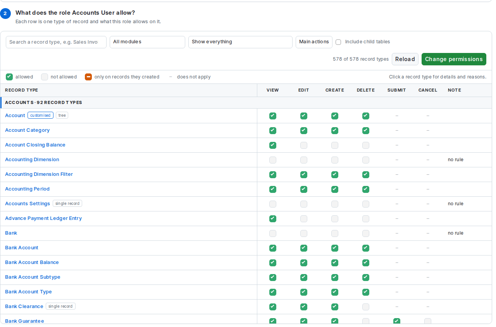

*Every box is the same size, so a column reads top to bottom at a glance. Rows are grouped by module; the record-type column stays put while the rest scrolls sideways.*

### 6.4 Click a record type for the reasons

A panel opens on the right with:

- **What can Abbas do here?** Every applicable action with a Yes or No in words, checked live with Frappe so it is exactly what the system enforces right now.
- **Why?** Each role's rule in words: *Role Accounts User allows: View, Edit, Create, Submit…*
- **Which records?** Any User Permission that narrows this record type, such as *Only where Company is Acme Ltd*.
- The **standard rules before they were customised**, if someone changed them.
- Buttons to open the same record type in Frappe's Role Permission Manager or to manage User Permissions.

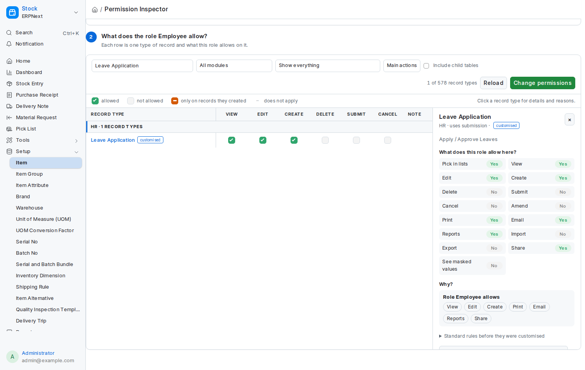

*Click any record type and the reasons open beside the table, without losing your place in it.*

### 6.5 Changing a permission

1. Press **Change permissions**. An orange banner confirms you are in editing mode and reminds you that nothing is saved until you press Save.
2. **Looking at a role:** click any box to tick or untick it.
   **Looking at a person:** click a box and a small dialog lists that person's roles. Tick the role that should allow the action, or untick the roles that currently allow it. The dialog reminds you that the change applies to everyone with that role.
3. Related actions follow Frappe's own rules automatically, and the page tells you when they do: turning **Edit** off also turns off Submit, Cancel and Amend; turning **Cancel** on also turns on Submit and Edit; **Import** needs Create.
4. Changed cells get an orange outline and a bar at the bottom counts your unsaved changes. Use **Only my unsaved changes** in the Show drop-down to review them.
5. Press **Save changes**. A confirmation spells out every change in a sentence, for example *Everyone with the role Accounts User will no longer be able to Edit on Sales Invoice.* Confirm, and Frappe enforces it immediately. **Discard** throws the edits away.

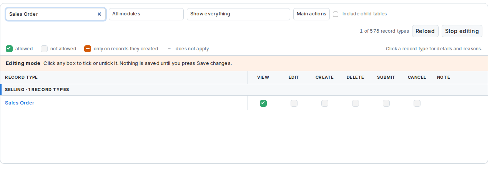

*Editing mode. The banner reminds you nothing is saved yet, changed boxes get an outline, and the counters above update as you go so you can see the effect before committing to it.*

What you cannot change here, and why:

- The **Administrator** account is above the permission system.
- Roles Frappe manages itself (Administrator, and for managers who are not Administrator also All, Guest, Desk User and custom user-type roles).
- Child tables, and the DocType, Module Def and Patch Log record types that Frappe's own manager also refuses.
- A record type must keep at least one rule; the page refuses to remove the last one.

### 6.6 Which records can they see?

Press **Which records can they see?** in the summary to open the User Permissions panel. It lists every restriction on the person, such as *Company = Acme Ltd, applies to every record type*, with buttons to **Add a restriction** or **Manage all** in Frappe's own User Permission list. This layer is shown separately on purpose, so that abilities (roles) and visibility (User Permissions) are never confused.

### 6.7 Safety

- Every request is checked on the server: without the System Manager role, every read and write is refused, whether or not the page is visible.
- Writes go to the same **Custom DocPerm** records that Frappe's Role Permission Manager writes, so the two tools always agree.
- A batch of changes is saved as one transaction. If any rule is invalid, nothing is saved and the message names the role and record type at fault.
- After every save the permission cache is cleared and the rows are re-read from the database, so the table shows what Frappe now enforces rather than what was requested.

---

## 7. Administrator Guide: Theme Settings

Open **Nexus Theme → Theme Settings** or `/app/theme-settings`. Every option is off by default.

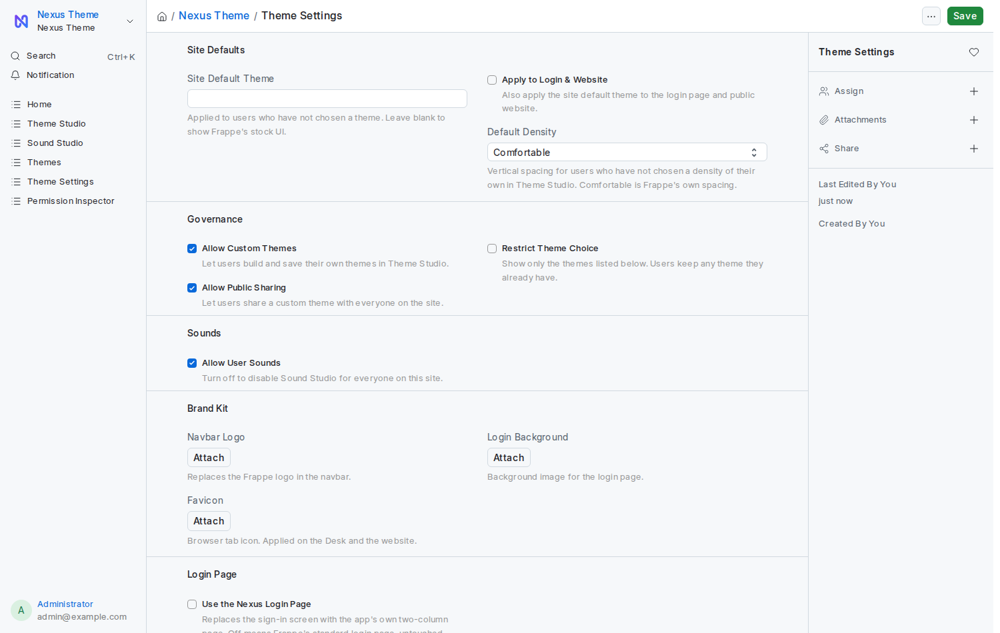

| Setting | What it does |
|---|---|
| **Site Default Theme** | Applied to everyone who has not chosen a theme. Leave blank to keep Frappe's stock look. People who chose Frappe's own look on purpose are left alone. |
| **Apply to Login & Website** | Also applies the site default theme to the login page and the public website, not only the Desk. |
| **Allow Custom Themes** | Lets people build and save their own themes in Theme Studio. |
| **Allow Public Sharing** | Lets people share a custom theme with everyone on the site. |
| **Restrict Theme Choice** + **Allowed Themes** | Shows only the listed themes in Theme Studio. Anyone already using another theme keeps it; they are not reset. |
| **Allow User Sounds** | Turn off to switch Sound Studio off for everyone. Their choices are kept for when it is switched on again. |
| **Navbar Logo** | Replaces the Frappe logo in the navbar. |
| **Favicon** | The browser-tab icon on the Desk and the website. |
| **Login Background** | A background image for the login page. On the Nexus login page it sits behind the coloured panel. |
| **Use the Nexus Login Page** | Replaces Frappe's sign-in screen with the app's own two-column page (see 7.1). Off by default. |
| **Login Brand Name**, **Login Brand Logo** | The name and logo above the sign-in form. Empty means the site's own app name and logo. |
| **Sign-in Subtitle**, **Footer Line** | The small line under *Sign In*, and a line at the bottom of the form. Leave the footer line empty and it reads ©, this year and the Login Brand Name. |
| **Panel Headline**, **Panel Text**, **Panel Points**, **Panel Figure**, **Panel Figure Note** | The words on the coloured panel: a large heading, a paragraph, up to six points shown with ticks, and an optional figure such as *300+* with a note. |

A theme can also be limited to certain roles: open the theme record (Themes list) and fill **Restrict to Roles**. People without one of those roles will not see it.

### 7.1 The Nexus login page

Tick **Use the Nexus Login Page** and `/login` becomes a two-column screen: your logo and the sign-in form on the left, a coloured panel with your headline, your points and an optional figure on the right. On phones the panel steps aside and the form fills the screen.

| On a computer | On a phone |
|---|---|
|  | 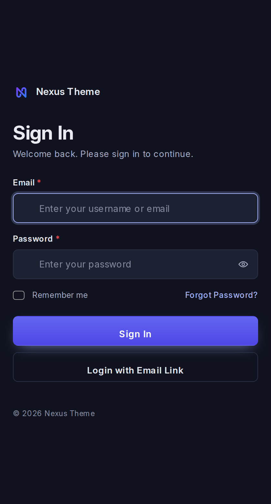 |

*Every word on that panel is yours to write. The screenshots show a site that filled
the Panel Headline in with its own name; a fresh install shows a plain "Welcome back"
until you type something else.*

**It follows the theme.** The page is painted from the **Site Default Theme**: background, text, inputs, the accent, the button and the corner radius all come from that theme, and the panel's gradient is mixed from its accent colour. Set a light theme and the page is light; set a dark one and it is dark. Someone who has already applied a theme of their own on the Desk sees the login page in *their* theme, because the browser remembers it; the page repaints before it is shown, so there is no flash of the wrong colours. With no site default theme set, the page uses a neutral light palette.

**It keeps everything Frappe's login does.** Password sign-in, the error banner, forgot password, sign-up, login with an email link, social logins, LDAP and two-factor all work exactly as before, because the page loads Frappe's own login script and keeps every element that script uses. Only the layout and the styling are the app's.

**Remember me** remembers your username on that device. It does not change how long you stay signed in; that is Frappe's session setting, and the checkbox will not pretend otherwise.

**It cannot lock you out.** Untick the switch and Frappe's own page is back at once. If anything about the page ever fails to render, Frappe's own page is served instead, automatically. No file in Frappe, ERPNext or any other app is changed by turning it on.

The name and logo above the form come from **Login Brand Name** and **Login Brand Logo**; left empty they fall back to **Navbar Logo** and the site's own app name and logo. The picture behind the panel comes from **Login Background**.

All of the wording lives in one place, in the **Login Page** section of Theme Settings:

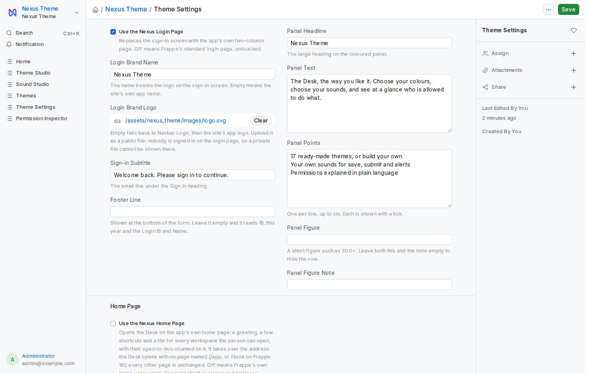

**Seeing it without signing out.** Open Theme Studio, pick a theme, and press **View Login**. A preview of the sign-in screen opens, drawn with the theme you have selected and the words you have written, so you can judge it before anyone else sees it. It also works when the page is switched off, so you can look first and decide after. There is a picture of it in [section 4.1](#41-the-five-minute-flow).

**Typical setups**

- *Company look for everyone, still free to personalise:* set a Site Default Theme, tick Allow Custom Themes, leave Restrict Theme Choice off.
- *Locked-down branding:* set a Site Default Theme, tick Restrict Theme Choice and list the approved themes, untick Allow Public Sharing.
- *Quiet office:* untick Allow User Sounds.

---

## 8. The Record Types Behind It All

Everything the two studios do is stored in three ordinary Frappe record types, listed in the **Nexus Theme** workspace sidebar. **You do not have to open any of them.** Theme Studio and Sound Studio create and update these records for you. They are here so you can see what is stored, fix something by hand, or set a theme up for the whole company.

| Record type | Holds | Who owns a row | Do you create these by hand? |
|---|---|---|---|
| **Theme Definition** | One theme: its colours, fonts and corner radius | The app (the 17 defaults) or the person who saved it | Rarely — see below |
| **User Theme Preference** | Which theme one person is using | One row per person, named after them | No |
| **User Sound Preference** | Which sound one person hears for each event | One row per person, named after them | No |

### 8.1 Theme Definition

One row is one theme. The 17 that ship with the app are here, and so is every theme anyone saved with **Save as Custom…**.

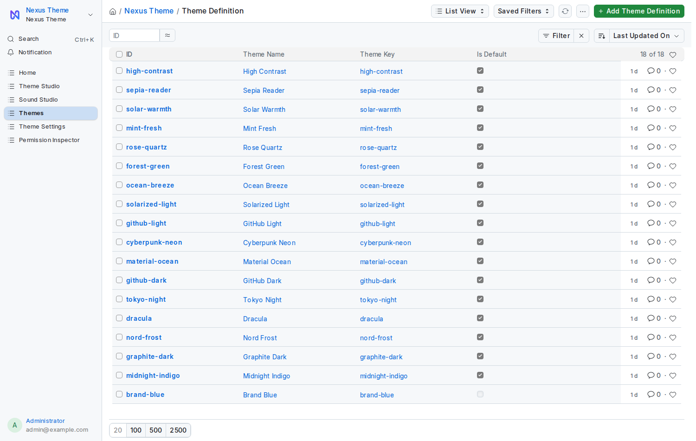

Open one and you see exactly the values Theme Studio edits, in four groups: **Identity**, **Colors**, **Buttons** and **Typography**.

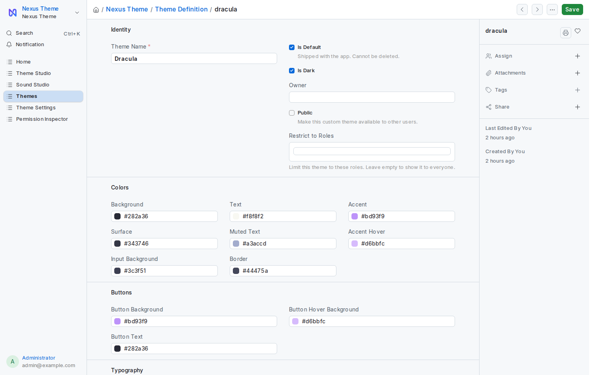

| Field | What it means |
|---|---|
| **Theme Name** | The name people see in Theme Studio |
| **Theme Key** | The short id used in the URL and in the stored preference. Lowercase letters, digits and hyphens. |
| **Is Default** | Ticked on the 17 themes that ship with the app. Those cannot be deleted. |
| **Is Dark** | Tells the app this is a dark theme, so Auto Light/Dark can pair it and the login page knows its polarity |
| **Owner** | The person who saved it. Empty on the shipped themes. |
| **Public** | Ticked means everyone on the site sees it under *Public Themes* |
| **Restrict to Roles** | Leave empty to show it to everyone. Fill it in and only those roles see the theme. |
| **Colors / Buttons / Typography** | The eleven colours, the font family, the base size and weight, and the corner radius |

**When to create a new one by hand**

Most people never do — press **Save as Custom…** in Theme Studio instead, which fills every field for you and checks the colours for readability first.

Create one here when you want a **company theme that already exists before anyone opens Theme Studio**: for example, an administrator building "Acme Blue", ticking **Public** so everyone sees it, and then setting it as the **Site Default Theme** in Theme Settings. Doing it here also lets you restrict a theme to certain roles, which Theme Studio does not offer.

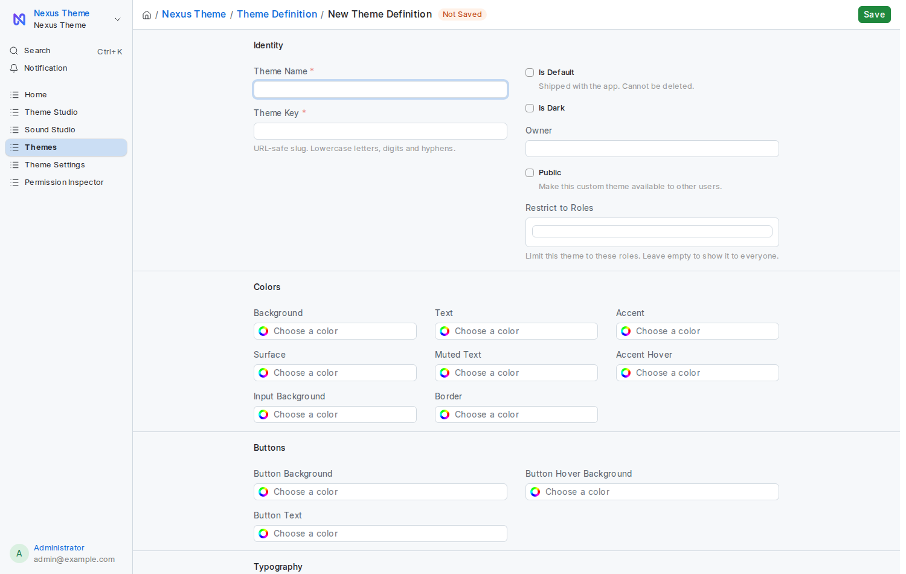

To create one: **Theme Definition → + Add Theme Definition**, then fill in

1. **Theme Name** and **Theme Key** (both required — the key must be unique)
2. Every colour under **Colors** and **Buttons**. Leaving one empty gives you a theme with a hole in it, so fill them all.
3. Tick **Is Dark** if the background is dark, and **Public** if others should see it.
4. **Save**.

Leave **Is Default** unticked. That flag marks the themes that ship with the app.

> A faster route to the same place: build the theme in Theme Studio, press **Save as Custom…**, then open the row it created and tick **Public** or fill in **Restrict to Roles**.

### 8.2 User Theme Preference

One row per person, named after their account. It is what makes your theme follow you to every device you sign in from.

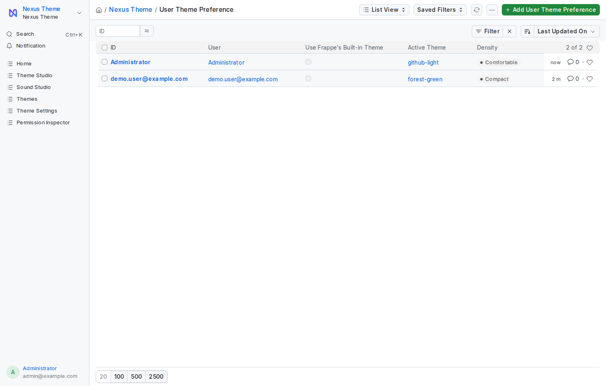

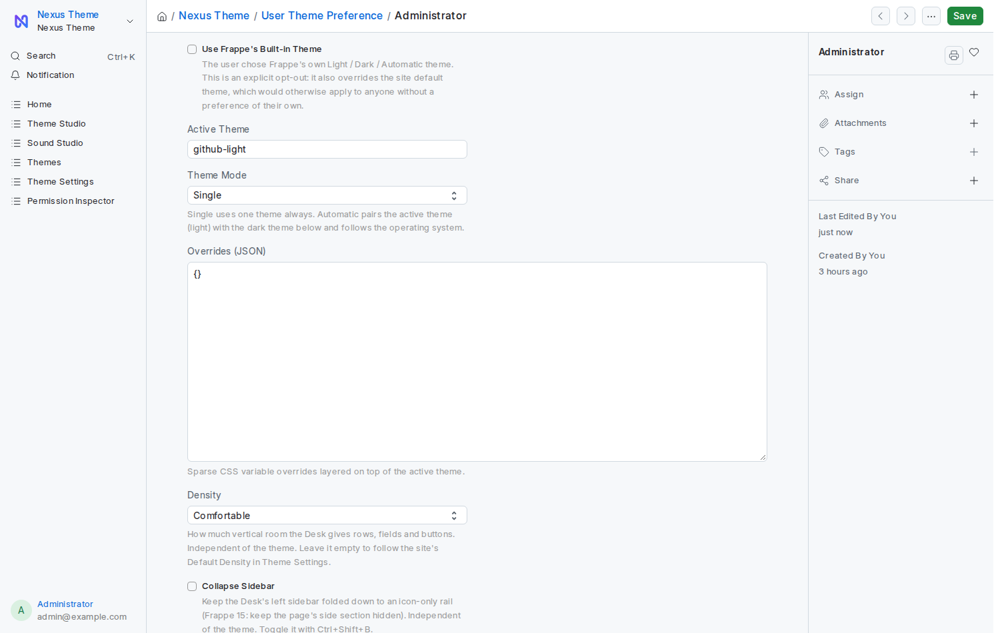

| Field | What it means |
|---|---|
| **User** | Whose preference this is. It is also the row's name, so there can only ever be one per person. |
| **Use Frappe Theme** | Ticked means this person turned Nexus off and is back on Frappe's stock look |
| **Active Theme** | The theme they are using |
| **Mode** | *Single* uses one theme all the time. *Automatic* follows the computer's light/dark setting. |
| **Dark Theme** | The theme used after dark when Mode is *Automatic* |
| **Overrides** | Any colours they changed by hand on top of the theme, stored as JSON |

**When to create a new one:** never, in normal use. The row appears by itself the first time someone presses **Apply** in Theme Studio, and updates every time they change something.

Two reasons an administrator might open one:

- **To see what someone is using** when they ask for help — quicker than asking them to read colours off their screen.
- **To reset one person** who has painted themselves into an unreadable corner: tick **Use Frappe Theme** and save, or just delete the row. Either way they are back on the site default the next time their Desk loads. Nothing else about their account is touched.

### 8.3 User Sound Preference

One row per person again, holding their master on/off switch and a child table of the sounds they chose.

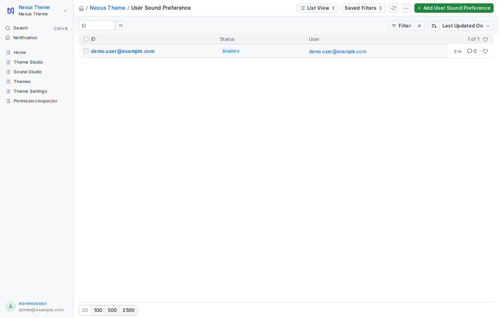

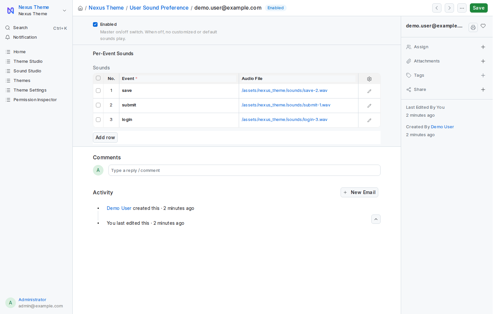

| Field | What it means |
|---|---|
| **Enabled** | Their own master switch. Unticked means the Desk stays silent for them. |
| **Sounds** | One row per event they changed: the **Event** key (`save`, `submit`, `login`…), the **Audio File** and the **Volume** |

Only events the person actually changed appear in the table. An event with no row plays the sound that ships with the app.

**When to create a new one:** never, in normal use. Sound Studio writes this row the first time someone picks a sound or moves a slider.

An administrator might open one to **silence one person** (untick **Enabled**) or to **remove a file someone uploaded** by deleting its row. To silence the whole site instead, untick **Allow User Sounds** in Theme Settings — that overrules every row here.

> **Deleting a row is safe.** These two preference records are only preferences. Delete one and that person simply goes back to the site default the next time their Desk loads; no theme, no sound file and no part of their account is lost.

---

## 9. Who Can Use What (Roles)

| Feature | Needs |
|---|---|
| Theme Studio, Sound Studio, personal preferences | **Theme User** (granted automatically to every Desk user) |
| Theme Settings, Themes list edits, deleting other people's themes | **System Manager** |
| Permission Inspector | **System Manager**, checked on the server for every request |
| Website users (portal logins) | Nothing. They never see the Desk tools and never receive the Theme User role. |

---

## 10. Everyday Recipes

**I want dark mode at night and light in the day.** Theme Studio → Auto Light/Dark → pick one of each → Mode: Automatic → Save.

**I want the whole team on our brand colour.** Theme Studio → Customize → Generate → enter the brand colour → choose a variant → Save as Custom with *Share with other users* ticked. Then, as an administrator, set it as the Site Default Theme.

**I made a theme on staging and want it in production.** Export on staging, Import on production, then set it as default or share it.

**Everything went silent.** Sound Settings → check the Enable sounds switch. If it is on, ask an administrator whether Allow User Sounds is off in Theme Settings.

**Why can Abbas delete invoices?** Permission Inspector → A person → Abbas → search *Sales Invoice* → the Delete cell says Yes and the Because of column names the role. Click the row for the full reasons.

**Stop the Sales User role from cancelling invoices.** Permission Inspector → A role → Sales User → Change permissions → search *Sales Invoice* → click Cancel to make it No → Save changes → confirm.

**Give a new role access to one record type.** Permission Inspector → A role → the role → Change permissions → find the record type → click View to make it Yes (add Edit, Create and so on as needed) → Save changes.

---

## 11. How It Works Under the Hood

**Record types the app owns**

| Record type | Purpose |
|---|---|
| Theme Definition | One theme: 11 colours, font, size, weight, corner radius, animation speed, hover lift, owner, public flag, role restrictions. The 17 bundled ones are marked *Is Default* and ship as fixtures. |
| User Theme Preference | One row per person: the active theme, the mode (Single or Automatic), the dark theme for Automatic, per-user colour overrides, and the *Use Frappe's Built-in Theme* opt-out. |
| User Sound Preference + User Sound Mapping | One row per person with the master switch and a child row per event (file and volume). |
| Theme Settings | The single site-wide settings record described above. |
| Allowed Theme, Theme Role | Child tables behind Allowed Themes and Restrict to Roles. |

**How a theme reaches the screen.** The active theme is placed in the page's boot data, so the first paint is already themed. `theme_manager.js` writes the theme's values into CSS variables on the page and marks the page light or dark; Frappe's own components pick the variables up. Frappe's built-in Switch Theme dialog is extended so Nexus themes appear there, and choosing one of Frappe's own themes hands control back cleanly.

**How a sound plays.** `sound_manager.js` wraps Frappe's sound player: it swaps in your chosen file per event, applies the volume, honours the master switch and cuts every sound at three seconds.

**How the Permission Inspector reads and writes.** It reads through Frappe's own helpers (`get_valid_perms`, `get_all_perms`, `get_roles`, `has_permission`) and writes through `Custom DocPerm`, the same mechanism the stock Role Permission Manager uses. It has no tables and no permission logic of its own; if it were removed, nothing about your permissions would change.

**How the login page takes over `/login`.** Frappe asks every registered page renderer whether it can serve a route, and an app's own renderers are asked first. The app registers one that answers yes only for `/login`, only while the switch in Theme Settings is on, and only if its template is present; otherwise it declines and Frappe's own login page renders. It reuses Frappe's login context (social logins, LDAP, sign-up, the already-signed-in redirect) and Frappe's login script, and adds the layout, the theme variables and a small head script that repaints the page in the visitor's remembered theme.

**Safety checks on saved data.** Colour and style values are validated before they are stored (no CSS can be injected through a theme), sound URLs must point at files this site serves, imported theme files are validated field by field, and the words an administrator types for the login panel are escaped before they reach the page.

---

## 12. For Developers

### 12.1 Layout of the app

```
nexus_theme/
├── api.py                      # whitelisted theme and sound API
├── hooks.py                    # includes, apps-screen tile, doc events, boot session
├── install.py / uninstall.py   # Theme User role, menu items, desktop icon, assets
├── website.py                  # login page and website theming
├── login_page.py               # the Nexus login page (page_renderer hook, opt-in)
├── templates/nexus_login/      # its template
├── permission_inspector/api.py # Permission Inspector API (System Manager only)
├── nexus_theme/doctype/…       # Theme Definition, preferences, Theme Settings
├── nexus_theme/page/           # theme_studio, sound_studio, permission_inspector
├── nexus_theme/workspace/      # the Nexus Theme workspace
├── public/js, public/css       # theme_manager, theme_switcher, theme_editor,
│                               # sound_manager, sound_studio, brand_kit, …
├── public/sounds               # 36 synthesised presets
├── utils/                      # contrast, css_safety, palettes, palette_generator, web_css
├── fixtures/theme_definition.json
├── tests/                      # pure unit tests (no site needed)
└── tests_site/                 # site-backed tests
tools/generate_sounds.py        # regenerates every preset sound
tools/generate_logo.py          # regenerates the logo set in logos/
```

### 12.2 Python API

All methods live in `nexus_theme.api` and are whitelisted, so they work from `frappe.call`, REST (`/api/method/nexus_theme.api.<name>`) and server scripts. They act for the logged-in user and need the Theme User role.

```python
# Themes
get_available_themes()                       # defaults, owned, public
get_active_theme()                           # theme, mode, dark theme, overrides, source
set_active_theme(theme_name, overrides=None) # apply a theme (+ optional colour overrides)
set_theme_mode("Automatic", dark_theme="dracula")
clear_active_theme()                         # back to Frappe's own look
save_custom_theme(payload, share_public=0)   # payload = the 11 colours + style fields
delete_custom_theme(theme_name)
export_theme(theme_name)                     # portable JSON
import_theme(payload, share_public=0)
get_recommended_palettes()                   # the 8 curated palettes
get_login_preview()                          # brand + words for the login preview
generate_palette(seed="#8c6f3f", is_dark=0)  # 3 accessible variants from one colour

# Sounds
get_user_sounds()                            # enabled flag + event -> {url, volume}
set_user_sound("save", file_url="/files/pop.wav", volume=0.6)
clear_user_sound("save")
toggle_user_sounds(enabled=0)
clear_all_user_sounds()
```

Permission Inspector methods live in `nexus_theme.permission_inspector.api` and require System Manager:

```python
get_options()
get_matrix(target_type="user", target="abbas@example.com", include_child=0)
get_matrix(target_type="role", target="Accounts User")
get_doctype_detail("user", "abbas@example.com", "Sales Invoice")   # rules, live check, user permissions
get_user_permissions("abbas@example.com")
save_changes([{"doctype": "Sales Invoice", "role": "Accounts User", "ptype": "write", "value": 0}])
refresh_cache(target_type="user", target="abbas@example.com")
```

`save_changes` validates every rule, cascades dependencies the way Frappe requires, saves the batch under a savepoint, clears the permission cache and returns the fresh matrix rows for the affected record types.

### 12.3 JavaScript API

```javascript
window.openThemeSwitcher();     // open Theme Studio
window.openSoundStudio();       // open Sound Studio

ThemeManager.applyTheme("theme_key", { bg_primary: "#ffffff" }); // apply now
ThemeManager.handOffToFrappe();                                  // back to Frappe's look

SoundManager.applyMapping({ save: { url: "/files/pop.wav", volume: 0.7 } });
SoundManager.setEnabled(false);
```

### 12.4 Tests

```bash
# Pure unit tests, no site needed
python -m unittest discover -s apps/nexus_theme/nexus_theme/tests

# Site-backed tests (set allow_tests on the site first)
bench --site yoursite.com set-config allow_tests true
bench --site yoursite.com run-tests --app nexus_theme
bench --site yoursite.com run-tests --app nexus_theme --module nexus_theme.tests_site.test_permission_inspector
bench --site yoursite.com set-config allow_tests false
```

### 12.5 Regenerating assets

```bash
python3 tools/generate_sounds.py   # rewrites public/sounds from the recipes in the script
python3 tools/generate_logo.py     # rewrites logos/ (needs Pillow and fontTools)
bench build --app nexus_theme      # rebuild the JS/CSS bundles after editing public/
```

---

## 13. Things to Know

- **Themes style the Desk, not hard-coded colours.** A third-party app that paints its own fixed colours is not restyled. The built-in Frappe and ERPNext interface is.
- **Restricting themes never resets anyone.** If an administrator narrows the allowed list, people keep the theme they already have; they just cannot pick others outside the list.
- **The login sound may be skipped.** Browsers block audio until you interact with a page. Every other sound plays after your first click.
- **Custom themes survive updates.** New bundled themes never overwrite your own.
- **Choosing Frappe's own look opts you out of the site default** until you pick a Nexus theme again.
- **Deleting a theme in use is allowed** for your own themes; users of it fall back to the site default. A theme that is the site default or on the allowed list must be taken out of Theme Settings first.
- **Permission changes are site-wide.** The Permission Inspector edits roles, and a role is shared by everyone who holds it. The confirmation dialog states this before every save.
- **The Nexus login page is a switch, not a default.** Installing the app changes nothing about `/login`. An administrator turns the page on in Theme Settings, and can turn it off again the same way; if it ever cannot render, Frappe's own page is served.
- **"Set User Permissions" is not a flag in Frappe v16.** It was removed in an earlier version. The inspector shows the flags v16 actually has, including Mask and custom permission types.

---

## 14. Troubleshooting and FAQ

**I do not see Theme Studio in the avatar menu.**
You may be a Website User rather than a Desk user, or the app was installed before your account and the role has not been granted yet. Ask an administrator to run `bench --site yoursite.com migrate`; it grants the Theme User role to every Desk user.

**I picked a theme but nothing changed, or it went back after reload.**
Press **Apply** in Theme Studio; clicking a card only shows it in the Live Preview. If you chose a Nexus theme inside Frappe's own Switch Theme dialog, it is applied at once.

**I saved a theme and cannot find it.**
Private themes are under **My Custom Themes**; shared ones under **Public Themes**.

**A colleague cannot see the theme I shared.**
An administrator may have turned off Allow Public Sharing, or the theme has Restrict to Roles set and your colleague lacks those roles.

**Sounds do not play.**
Check the Enable sounds switch in Sound Settings, then the browser's site permissions, then ask an administrator whether Allow User Sounds is off in Theme Settings. Refresh once and click anywhere on the page; browsers block audio before the first interaction.

**The Permission Inspector page is missing or shows "not permitted".**
Only System Managers can open it. Ask one to open `/app/nexus-permission-inspector`.

**I changed a permission and the person still cannot do it.**
Open the record type in the inspector and read **What can they do here?**; it is checked live. If it says Yes, ask the person to reload the page. If it says No, another rule or a User Permission is limiting them; the **Why?** and **Which records?** sections show which.

**I want to undo a permission change.**
Change it back in the inspector, or open the record type in Frappe's Role Permission Manager and press Restore Original Permissions to return to the standard rules.

**Can I use my company logo?**
Yes. Theme Settings → Navbar Logo, Favicon and Login Background.

**How do I see the login page without signing out?**
Theme Studio → **View Login**.

**I switched the Nexus login page on but still see Frappe's.**
Reload once; if your bench runs under a process manager, restart it (`bench restart`) so the web server picks up the change. The page also falls back to Frappe's own when the site has not been migrated since the update.

**The login page is in the wrong colours.**
It uses the Site Default Theme. If your own browser shows different colours from a colleague's, that is your remembered Desk theme; pick a theme in Theme Studio, or choose Frappe's own look, and the login page follows.

**Can an administrator force one theme for everyone?**
Set a Site Default Theme and tick Restrict Theme Choice with that single theme in the allowed list. People who chose Frappe's own look keep it; everyone else sees the default.

**Do I have to create Theme Definition, User Theme Preference or User Sound Preference records?**
No. The studios create and update all three for you. See [section 8](#8-the-record-types-behind-it-all) for what each one holds and the few cases where an administrator would open one by hand.

**Someone made their Desk unreadable and cannot get to Theme Studio.**
Open **User Theme Preference**, find the row named after them, tick **Use Frappe Theme** and save — or just delete the row. They are back on the site default the next time their Desk loads, and nothing else about their account changes.

**I created a Theme Definition by hand and it looks broken.**
Every colour under **Colors** and **Buttons** has to be filled in; an empty one leaves a hole in the theme. Open it in Theme Studio instead and press **Save as Custom…**, which fills all of them and checks readability first.

**Does any of this change my data?**
Themes and sounds change only colours and audio. The Permission Inspector changes permission rules only when you press Save and confirm, using the same records as Frappe's own manager.

---

## 15. Requirements and License

- **Frappe / ERPNext:** version 16
- **Python:** as required by your Frappe 16 bench
- **Database:** MariaDB with InnoDB
- **Browser:** any modern browser with audio support

MIT licence for the code, every bundled theme and palette, the logo set and all synthesised sounds. See [license.txt](license.txt).

---

<p align="center">
  
</p>

<p align="center"><strong>Nexus Theme</strong> &nbsp;·&nbsp; built with Frappe &nbsp;·&nbsp; by Abbas Raza</p>
