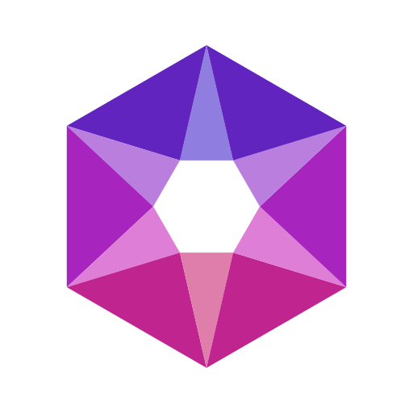

<div align="center" markdown="1">



# Nexus Theme

**Make your workspace yours!** Personalize your ERPNext/Frappe colors and sounds in seconds. Pick from 17 pre-designed themes, or create your own from scratch. Every change updates instantly, and everything is built to be easy on the eyes.

  

</div>

---

## ✨ What Can You Do?

### 🎨 Pick a Theme (17 ready-made designs)
Click the avatar in the top-right corner → **Theme Studio**. You'll see three tabs:
- **Default** — 17 pre-designed themes: Midnight Indigo, Dracula, Tokyo Night, GitHub Light/Dark, Solarized, Nord Frost, Cyberpunk Neon, High Contrast, and more.
- **Custom** — Themes you created and saved privately (only you see them).
- **Public** — Themes other team members shared with everyone.

**How it works:** Click any theme card → it applies instantly. You can see a live preview of how it looks. Don't like it? Pick another one — changes happen immediately.

---

### 🛠️ Customize Colors (Easy Mode & Power Mode)
Click **Customize** on any theme to open the editor. It has two levels:

#### Basic Mode (most people need this)
Change these core colors:
- **Background** — The main backdrop of your workspace
- **Text** — How text looks on that background
- **Accent** — Links and highlights
- **Buttons** — Color, hover effect, and text on buttons
- **Fonts** — Family, size, and weight
- **Corners & Animation** — Border radius and how fast things fade in/out
- **Hover Effect** — Cards lift slightly when you hover over them (optional)

**Live Preview:** As you adjust, your workspace behind the dialog updates instantly. See exactly how it looks before saving.

#### Advanced Mode (for fine-tuning)
Everything in Basic, plus:
- **Surface colors** — Card backgrounds and sidebars
- **Input fields** — Search boxes and form fields
- **Muted text** — Secondary labels and hints
- **Borders** — Line colors and thickness
- **Font weight** — Make text bolder or lighter
- **Transition speed** — How fast hover effects animate

**Save your work:** When done, click **Save as Custom Theme** → give it a name → optionally check "Share with team" to let others use it.

---

### 🎯 Use Ready-Made Color Palettes (Instant 11-color themes)
Click the **Palettes** tab to fill all 11 colors at once from curated, professionally-designed sets:
- Indigo Mist
- Forest Paper
- Rose Quartz
- Graphite Amber
- Midnight Violet
- Carbon Teal
- Obsidian Rose
- Nordic Frost

Each palette is tested to make sure text is readable on every background (WCAG AA certified). One click fills the editor → customize from there if you want → save.

---

### ⚡ Generate a Theme from Your Brand Color (NEW!)
Have a single brand color? Let the app build an entire 11-color theme for you.

**How it works:**
1. Click the **Generate** tab
2. Enter your brand color (or pick from the color picker)
3. Toggle **Light** or **Dark** mode
4. Click one of three variants:
   - **Neutral Canvas** — Greyscale background, your color only on accents. Best for focus.
   - **Tinted Canvas** — Background carries your brand hue. Feels more branded.
   - **High Contrast** — Super readable text, stronger borders. Best for accessibility.
5. See the **Passes WCAG AA** badge with exact contrast numbers
6. Click the variant → colors fill the editor → customize by hand if needed → save

**Why this works:** Most color apps just pick lightness numbers (50%, 30%, etc.), which breaks across the color wheel. This one solves for *readability contrast* instead, so your theme works whether your brand is yellow, blue, or anything in between.

---

### 🔊 Sound Studio (Personalize Your Audio Feedback)
Open the user dropdown (avatar, top-right) → **Sound Settings**.

**What you can customize:**
- **Login** — When you enter the Desk
- **Logout** — When you leave
- **Save** — When you save a form
- **Submit** — When you submit a document
- **Cancel** — When you cancel
- **Delete** — When you delete something
- **Error** — When something goes wrong
- **Email** — When an email is sent
- **Alert** — When you get a notification banner
- **Notification (bell)** — When you get a real-time message
- **Missing Fields** — When you try to save but forgot required fields

**For each sound:**
- **Preview** — Hear what it sounds like right now
- **Upload** — Drop your own `.mp3` or `.wav` file
- **Use a preset** — Pick from Glitch, Buzz, Chirp, Beam, and more (varies by event)
- **Volume slider** — 0–100%
- **Reset** — Go back to the built-in sound

**Master controls at the bottom:**
- **Reset All to Default** — Wipe all your customizations in one click
- **Enable/Disable** — Mute all sounds without deleting them

---

### 🌙 Auto Light/Dark Mode
Pair a light theme with a dark one → the app follows your OS setting. When you change your system theme, your workspace switches automatically.

---

### 👥 Share Themes with Your Team
When you save a theme, tick **Share with team** to publish it. Everyone sees it in the Public tab. Admins can restrict who can share or turn off custom themes entirely.

---

### 🏢 Admin Control (Theme Settings)
**If you're an admin:**
- Set a **site default theme** for everyone
- Restrict themes to an approved list
- Turn off custom themes or public sharing
- Add your **company logo** to the navbar, favicon, and login page
- Apply themes to the **login page and public website** (not just the Desk)
- Master on/off for all sounds

All settings are off by default — turn on what you need, and the app doesn't interfere with anything else.

---

### 📊 Move Themes Between Sites
- **Export** your custom theme as a `.json` file
- **Import** it on another site (staging, production, different company)
- Themes can live in your version control system
- When you import, the app validates everything to make sure it's safe

---

### 🔐 Safety Built In
Before you save any theme, the app checks:
- Text on background is readable (≥4.5:1 contrast ratio)
- Text on cards is readable (≥4.5:1 contrast ratio)
- Button text on buttons is readable (≥3.0:1 contrast ratio)

If something fails, you get a clear message showing what to fix. **You can't accidentally ship an unreadable theme.**

---

## 🚀 Getting Started (5 Minutes)

**Nothing to set up.** The app is ready the moment you log in.

### Step 1: Open Theme Studio
Click the **green avatar** in the top-right corner → click **Theme Studio**.

### Step 2: Pick a Theme
You'll see theme cards. Click any one → it applies instantly to your workspace.

### Step 3: (Optional) Customize It
Click **Customize** to tweak colors, or skip this if you like the theme as-is.

### Step 4: (Optional) Customize Sounds
Back at the avatar → click **Sound Settings**. For each event (Save, Submit, etc.), you can pick a preset sound or upload your own.

**That's it!** Your changes save automatically.

---

## ⚙️ Quick Reference: What Each Editor Tab Does

| Tab | Use When | What You Get |
|---|---|---|
| **Basic** | You want to change main colors | Background, text, accent, buttons, fonts |
| **Advanced** | You want fine control | Cards, inputs, borders, animation speed |
| **Palettes** | You want a complete 11-color theme instantly | 8 professionally-designed color sets |
| **Generate** | You have one brand color and want a full theme | AI-generated theme from your color (Light or Dark) |

---

## 🎵 Sound Events at a Glance

| Event | Fires When | Presets Available |
|---|---|---|
| **Login** | You first enter the Desk | Yes |
| **Logout** | You leave | Yes |
| **Save** | You save a form | Yes |
| **Submit** | You submit a document | Yes |
| **Cancel** | You cancel a document | Yes |
| **Delete** | You delete something | Yes |
| **Error** | Something goes wrong | Yes |
| **Email** | An email is sent | Yes |
| **Alert** | You get a notification banner | Yes |
| **Notification** | You get a real-time message | Yes |
| **Missing Fields** | You forget required fields | Yes |

For each, you can adjust volume, use a preset sound, or upload your own.

---

## 🔄 Reset Your Choices

- **Reset one theme:** In Theme Studio, click **Reset to Frappe Default** → you go back to the vanilla Frappe look
- **Reset all sounds:** In Sound Settings, click **Reset All to Default** at the bottom → all sounds go back to built-in presets

Both actions are reversible — you can change your mind anytime.

---

## 💻 For Developers & Admins

### Python API (Backend)

Use these endpoints from scripts, REST calls, or other apps:

**Theme Management:**
```python
# Get all available themes
get_available_themes()  # Returns: defaults, custom, public

# Get your current theme
get_active_theme()  # Returns: theme name + color overrides

# Apply a theme
set_active_theme("theme_name", overrides={"bg_primary": "#ffffff"})

# Save your edits as a new theme
save_custom_theme({
  "theme_name": "My Theme",
  "bg_primary": "#ffffff",
  ...11 colors total...
}, share_public=0)  # 0=private, 1=shared

# Delete a custom theme
delete_custom_theme("My Theme")

# Go back to vanilla Frappe
clear_active_theme()

# Get the 8 curated palettes
get_recommended_palettes()

# Generate a theme from a brand color
generate_palette(seed="#8c6f3f", is_dark=0)  # Returns 3 variants

# Set automatic light/dark switching
set_theme_mode("Automatic", dark_theme="Dark Theme Name")

# Export/import themes as JSON
export_theme("theme_name")  # Get JSON
import_theme(json_data, share_public=0)  # Load JSON
```

**Sound Management:**
```python
# Get all sound settings
get_user_sounds()  # Returns: enabled flag + event→sound mapping

# Set a sound for an event
set_user_sound("save", file_url="/files/mysound.mp3", volume=0.6)

# Clear a sound (back to default)
clear_user_sound("save")

# Master on/off for all sounds
toggle_user_sounds(enabled=1)  # 1=on, 0=off

# Reset all sounds to default
clear_all_user_sounds()
```

**Key Points:**
- All endpoints respect Frappe permissions (Theme User role required)
- Changes invalidate the user's cache — they see the update on the next page load
- No `bench restart` needed
- All data is stored in app-owned database tables

### JavaScript API (Frontend)

Open dialogs programmatically:
```javascript
// Open Theme Studio
window.openThemeSwitcher();

// Open Sound Settings
window.openSoundStudio();
```

Apply themes at runtime:
```javascript
// Change theme + colors immediately
ThemeManager.applyTheme("theme_name", {
  bg_primary: "#ffffff",
  text_primary: "#000000"
  // ...other colors
});

// Set sounds for events
SoundManager.applyMapping({
  login: { url: "/files/login.mp3", volume: 0.5 },
  save: { url: "/files/save.wav", volume: 0.7 }
});

// Mute all sounds
SoundManager.setEnabled(false);

// Unmute all sounds
SoundManager.setEnabled(true);
```

### Under the Hood

- **Themes:** Stored in `Theme Definition` DocType, synced as fixtures
- **User Preferences:** Stored in `User Theme Preference` and `User Sound Preference` DocTypes
- **Sound Files:** Stored as standard Frappe `File` records
- **CSS Variables:** Themes inject CSS variables into the page, so all components that use them auto-update
- **Sound Playback:** Managed by `sound_manager.js` — handles event detection, 3-second audio cap, volume control

---

## ⚠️ Things to Know

**Themes only style the Desk itself**  
Some third-party apps or custom code might hard-code their own colors. Nexus Theme can't override those — but it handles 99% of the built-in Frappe UI.

**If an admin restricts themes, your current theme stays**  
If your admin narrows the allowed theme list and your current theme is removed from it, you keep using it. You just can't switch to other restricted themes. It's not a forced reset.

**First login sound might not play (browser autoplay rules)**  
Browsers block audio before you interact with the page. The login sound plays 250ms after the Desk loads, so very strict browser policies might skip it. Other sounds play normally after you interact with the page once.

**Custom themes stay even after app updates**  
When you create a theme, it's yours. New default themes in app updates won't overwrite it.

**Choosing Frappe's own theme opts you out of the site default**  
If your admin set a site default theme, it applies to anyone who hasn't picked one. Choosing Frappe Light, Timeless Night, or Automatic in Frappe's own Switch Theme dialog — or clicking **Reset to Frappe Default** in Theme Studio — records that you want Frappe's built-in look, so the site default won't come back on your next reload. Pick any Nexus theme again to opt back in.

**Deleting a theme that's in use**  
You can delete your own custom theme even while it's applied — for you, or for anyone you shared it with. Whoever was using it goes back to the site default (or Frappe's own look if there isn't one). A theme an admin set as the site default or put on the allowed list has to be taken out of Theme Settings first.

**Sound file storage**  
When you upload a sound file (`.mp3` or `.wav`), it's stored as a normal Frappe file. If your Frappe instance has file size or quota limits, very large audio files count against those limits.

---

## 🔧 System Requirements

- **ERPNext/Frappe:** v16+
- **Python:** 3.10+
- **Database:** MariaDB 10.6+ with InnoDB
- **Browser:** Any modern browser (Chrome, Firefox, Edge, Safari 14+) with audio support

---

## 🎵 About the Built-in Sounds

All 36 bundled sounds (12 events × 3 presets per event) are **synthesized from scratch** — not recordings or samples. They're created by code in [`tools/generate_sounds.py`](tools/generate_sounds.py) using only the Python standard library.

This means:
- No copyright concerns
- No external audio samples needed
- Covered by the same MIT license as the app

To customize sounds, edit `tools/generate_sounds.py` and run:
```bash
python3 tools/generate_sounds.py
```

---

## 📄 License

MIT — covers the application code, all bundled themes and palettes, and all synthesized sound files.  
See [license.txt](license.txt) for details.

---

## ❓ FAQ

**Q: Can I use my company logo in the theme?**  
A: Yes! If you're an admin, go to Theme Settings → Brand Kit, and upload your logo, favicon, and login background.

**Q: I saved a theme but don't see it in the list.**  
A: Check the **Custom** tab — private themes show there. If you checked "Share with team," look in the **Public** tab.

**Q: Can I export my theme and use it on another site?**  
A: Yes. Click **Export** in Theme Studio → save the JSON file. On another site, click **Import** and upload the file. The app validates everything for safety.

**Q: My sounds aren't playing. What's wrong?**  
A: A few possibilities:
- Your browser might block autoplay audio. Refresh the page and interact with it once.
- Sounds might be disabled. Go to Sound Settings and check the master switch.
- Your browser might have sound disabled for this site (check browser permissions).
- The sound file might be corrupt. Try uploading a different one.

**Q: If I leave a theme as-is and don't save it, does it stay?**  
A: No. If you make changes in the editor but close without saving, you lose them. The live preview shows how it would look, but it doesn't actually apply until you click **Apply** or **Save as Custom**.

**Q: Can I delete a theme I created?**  
A: Yes. In Theme Studio, find the theme in the **Custom** tab, and look for a delete or trash icon. Deleted themes can't be recovered, so be sure.

**Q: What's the difference between "Apply" and "Save as Custom"?**  
A: **Apply** uses the theme right now (but doesn't save it as a named theme, so if someone else configures a theme after you, yours goes away). **Save as Custom** stores it with a name you choose, so you can always find it again in the Custom tab.

**Q: Can an admin force everyone to use one theme?**  
A: Yes. Go to Theme Settings → set a "Site Default Theme" → turn on "Restrict Theme Choice." Users can still see other themes, but yours becomes the default. (Users can still override it if you allow custom themes.)

**Q: Will changing my theme break anything?**  
A: No. Themes only change colors and sounds. They don't touch data, forms, or functionality.

**Q: I have a lot of custom sounds. Can I back them up?**  
A: Sound settings are stored in Frappe's database, so they back up with your regular backups. Audio files you upload are stored as Frappe Files, also in your backups. You can manually download them from Sound Settings using the **Preview** button (depends on browser download permissions).

---

## 🆘 Still Have Questions?

Check your Frappe console (Ctrl+K / Cmd+K) and search for:
- **Theme Studio** — opens the theme editor
- **Sound Settings** — opens the sound customizer
- **Theme Settings** (admin only) — controls site-wide defaults

Or ask your Frappe administrator for help.

---

<p align="center">
  
</p>

<p align="center"><strong>Nexus Theme</strong> &nbsp;·&nbsp; built with Frappe &nbsp;·&nbsp; by Abbas Raza</p>
